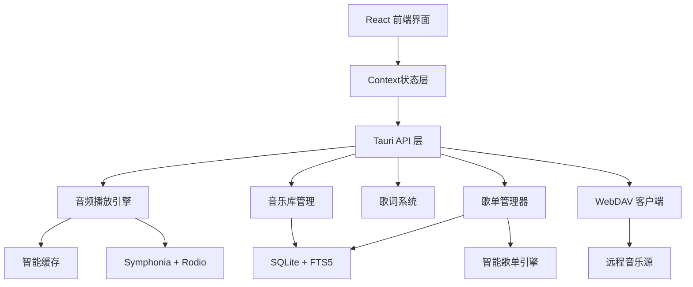

# WindChime Player

[](https://opensource.org/licenses/MIT)
[](https://github.com/16Mu/wind-chime-player)
[](https://tauri.app/)
[](https://reactjs.org/)
[](https://www.typescriptlang.org/)
[](https://www.rust-lang.org/)

> 🎵 现代化跨平台音乐播放器，采用 macOS 风格设计，支持本地+WebDAV混合音乐源，提供沉浸式歌词体验

## 🌟 最新亮点 (v0.4.0.2)

- 🚀 **混合播放引擎** - 创新的双引擎架构，实现零延迟 seek（< 10ms）
- 🎨 **macOS 风格设计** - 完全对齐 Apple Music，iOS 蓝 + 毛玻璃效果
- 🔍 **智能设置搜索** - 模糊搜索 + 实时高亮，快速定位任何设置
- ⚡ **性能全面优化** - 虚拟滚动、懒加载、智能预加载，丝般顺滑
- 🎵 **播放器核心修复** - 修复所有已知问题，稳定可靠

## 截图预览

### 主界面


### 沉浸式歌词


## ✨ 核心特性

### 🎵 音频播放
- **混合播放引擎** - Rust 原生引擎 + Web Audio API 双引擎架构，智能切换
- **零延迟 Seek** - 利用 Web Audio API 实现内存级 seek（< 10ms）
- **多格式支持** - MP3, FLAC, WAV, AAC, OGG 等主流格式
- **智能缓存** - 基于LRU的预加载算法，自动后台加载优化体验
- **歌单系统** - 普通歌单、智能歌单、导入导出（M3U/M3U8/JSON）
- **播放历史** - 自动记录播放数据，统计分析，实时刷新

### 🌐 远程音乐源
- **WebDAV集成** - 后端核心功能完成，支持流式播放
- **混合音乐源** - 本地和远程音乐统一管理
- **网络API** - 集成LrcApi公开API，自动获取歌词和封面

### 🎤 沉浸式体验
- **全屏歌词** - 支持多种格式和8种智能滚动动画
- **艺术家封面系统** - 智能预加载+懒加载+数据库持久化，自动同步网络封面
- **macOS 风格设计** - 采用 iOS 蓝色主色调（#007AFF）和 macOS 标准灰度
- **毛玻璃效果** - 标题栏和播放器采用半透明毛玻璃背景
- **双主题系统** - 深色/浅色模式无缝切换，跟随系统设置
- **响应式交互** - 流畅的动画效果和悬停反馈
- **专辑/艺术家视图** - 现代化网格布局，支持懒加载和虚拟滚动

### 🔧 开发者功能
- **智能设置搜索** - 模糊搜索设置项，智能高亮定位
- **性能监控** - 实时监控缓存、音频、系统性能
- **FTS5搜索** - SQLite 全文搜索，快速定位音乐
- **跨平台** - Windows, macOS, Linux 一键运行
- **类型安全** - 全栈TypeScript + Rust类型检查

## 🚀 快速开始

### 安装依赖
   ```bash
# 安装前端依赖
   pnpm install
   
# Rust 依赖会自动安装
   ```

### 开发运行
   ```bash
   pnpm tauri dev
   ```

### 构建应用
   ```bash
   pnpm tauri build
   ```

## 📁 项目结构

```
wind-chime-player/
├── src/                          # 🖥️ 前端 React 源码
│   ├── components/               # React 组件
│   │   ├── playlist/            # 📋 歌单系统组件
│   │   │   ├── PlaylistCard.tsx      # 歌单卡片
│   │   │   ├── PlaylistsView.tsx     # 歌单列表视图
│   │   │   ├── PlaylistDetail.tsx    # 歌单详情
│   │   │   ├── CreatePlaylistDialog.tsx # 创建歌单对话框
│   │   │   └── SmartPlaylistEditor.tsx  # 智能歌单编辑器
│   │   ├── settings/            # ⚙️ 设置页面组件
│   │   │   ├── WebDAVSettings.tsx    # WebDAV设置
│   │   │   ├── ThemeSettings.tsx     # 主题设置
│   │   │   └── ...                   # 其他设置组件
│   │   ├── player/              # 🎵 播放器组件
│   │   ├── lyrics/              # 🎤 歌词组件
│   │   ├── library/             # 📚 音乐库组件
│   │   ├── LibraryPage.tsx      # 音乐库页面
│   │   ├── PlaylistPlayer.tsx   # 播放器控制
│   │   ├── ImmersiveLyricsView.tsx # 沉浸式歌词视图
│   │   ├── PlayHistoryPage.tsx  # 播放历史页面
│   │   ├── Sidebar.tsx          # 导航侧边栏
│   │   ├── SettingsPageNew.tsx  # 设置页面
│   │   └── ...                  # 其他组件
│   ├── contexts/                # 🔄 状态管理 Context
│   │   ├── PlaylistContext.tsx  # 歌单状态管理
│   │   ├── PlaybackContext.tsx  # 播放状态管理
│   │   ├── ThemeContext.tsx     # 主题状态管理
│   │   ├── PlayHistoryContext.tsx # 播放历史管理
│   │   ├── LibraryContext.tsx   # 音乐库状态管理
│   │   └── ...                  # 其他Context
│   ├── hooks/                   # 🎣 自定义 Hooks
│   ├── utils/                   # 🛠️ 工具函数
│   │   ├── colorExtractor.ts    # 颜色提取
│   │   ├── cache.ts             # 缓存管理
│   │   └── ...
│   ├── types/                   # 📝 TypeScript 类型定义
│   ├── assets/                  # 静态资源
│   ├── App.tsx                  # 主应用组件
│   ├── main.tsx                 # 前端入口
│   └── styles.css               # 全局样式
├── src-tauri/                   # 🦀 后端 Rust 源码
│   ├── src/
│   │   ├── lib.rs              # 主库文件 (Tauri 命令定义)
│   │   ├── main.rs             # 程序入口
│   │   ├── player.rs           # 🎵 音频播放引擎 (Actor模型)
│   │   ├── library.rs          # 📚 音乐库管理
│   │   ├── lyrics.rs           # 🎤 歌词解析系统
│   │   ├── db.rs               # 💾 数据库操作层 (SQLite + FTS5)
│   │   ├── playlist/           # 📋 歌单系统
│   │   │   ├── mod.rs          # 模块定义
│   │   │   ├── manager.rs      # 歌单管理器
│   │   │   ├── smart_playlist.rs # 智能歌单引擎
│   │   │   ├── exporter.rs     # 导出功能 (M3U/JSON)
│   │   │   ├── importer.rs     # 导入功能
│   │   │   └── types.rs        # 类型定义
│   │   ├── music_source/       # 🌐 音乐源抽象层
│   │   │   ├── mod.rs          # 模块定义
│   │   │   ├── manager.rs      # 音乐源管理器
│   │   │   ├── provider.rs     # 音乐源提供器
│   │   │   └── types.rs        # 相关类型定义
│   │   └── webdav/             # 🌐 WebDAV 集成
│   │       ├── mod.rs          # 模块定义
│   │       ├── client.rs       # WebDAV 客户端
│   │       ├── auth.rs         # 认证管理
│   │       └── types.rs        # WebDAV 类型
│   ├── capabilities/           # Tauri 权限配置
│   ├── icons/                  # 应用图标
│   ├── Cargo.toml             # Rust 依赖配置
│   └── tauri.conf.json        # Tauri 应用配置
├── docs/                       # 📖 项目文档
│   ├── error/                  # Bug报告和修复记录
│   ├── 歌单系统使用指南.md      # 歌单系统文档
│   ├── 歌单系统架构设计.md      # 歌单架构文档
│   ├── 主题系统修复总结.md      # 主题系统文档
│   └── ...                     # 其他文档
├── dist/                       # 构建输出目录
├── node_modules/               # Node.js 依赖
├── package.json               # 前端依赖配置
├── pnpm-lock.yaml            # PNPM 锁定文件
├── vite.config.ts            # Vite 构建配置
├── tailwind.config.js        # Tailwind CSS 配置
├── tsconfig.json             # TypeScript 配置
└── README.md                 # 项目说明文档
```

## 🏗️ 核心架构



### 🎯 核心模块

| 模块 | 功能 | 技术栈 | 状态 |
|------|------|--------|------|
| **混合播放引擎** | 双引擎架构、零延迟 seek、智能切换 | Rust + Web Audio API | ✅ 已完成 |
| **音频引擎** | Actor模型、智能缓存、硬件加速 | Rust + Symphonia + Rodio | ✅ 已完成 |
| **歌单系统** | 智能歌单、导入导出（M3U/JSON）、CRUD | Rust + SQLite + React | ✅ 已完成 |
| **歌词系统** | 多格式解析、8种动画、网络获取 | Rust + React | ✅ 已完成 |
| **艺术家封面系统** | 网络获取、数据库持久化、三层优化 | Rust + React + SQLite | ✅ 已完成 |
| **主题系统** | macOS 风格、深浅模式、毛玻璃效果 | Tailwind CSS + Context | ✅ 已完成 |
| **设置搜索** | 模糊搜索、智能高亮、平滑定位 | TypeScript + React | ✅ 已完成 |
| **播放历史** | 自动记录、统计分析、实时刷新 | SQLite + React | ✅ 已完成 |
| **WebDAV客户端** | 远程音乐源、流式播放 | Rust + reqwest | 🚧 后端完成 |
| **性能监控** | 实时性能数据展示 | Rust + React | 🚧 UI完成 |
| **搜索引擎** | FTS5全文检索 | SQLite + Rust | ✅ 已完成 |

## 🛠️ 技术栈

**前端**: React 19 + TypeScript + Tailwind CSS + Vite  
**后端**: Rust + Tauri 2.0 + SQLite + Symphonia + Rodio  
**音频**: 硬件加速解码 + 智能缓存 + 设备诊断  
**数据**: SQLite FTS5 全文搜索 + 查询缓存优化  
**网络**: WebDAV + 流式传输 + Range请求

## ⭐ 技术亮点

### 🧠 创新特性
- **混合播放引擎架构**：创新的 Rust + Web Audio API 双引擎设计，智能切换实现即时启动和零延迟 seek
- **双层 Ref 模式**：解决 React 闭包问题，实现稳定的函数引用和引擎智能路由
- **零延迟 Seek**：Web Audio API 内存级 seek（< 10ms），完美解决传统播放器 seek 延迟问题
- **智能引擎切换**：自动检测并平滑切换引擎，用户无感知，性能最优化
- **智能歌单引擎**：SQL 优化的规则引擎，支持14种操作符和复杂逻辑组合
- **单引擎歌词滚动**：事件驱动的状态机，避免 React 竞态条件
- **自适应动画**：根据歌词时间间隔动态调整滚动参数
- **混合音乐源架构**：支持本地+WebDAV 的可扩展音乐源系统
- **Stream 转 AsyncRead**：WebDAV 字节流到 Rust AsyncRead 的完整转换

### 🎨 设计创新
- **macOS 风格设计**：完全对齐 Apple Music 视觉语言，采用 iOS 蓝（#007AFF）和 macOS 标准灰度
- **毛玻璃效果**：标题栏和播放器使用 backdrop-filter 实现半透明毛玻璃背景
- **双主题系统**：深色/浅色模式无缝切换，符合 macOS 设计规范
- **高对比度优化**：浅色模式采用纯黑文字（#000000），提升可读性
- **沉浸式体验**：全屏歌词+专辑封面的电影级音乐体验
- **艺术家封面系统**：智能预加载+懒加载+数据库持久化，自动同步网络封面
- **响应式动画**：8种歌词滚动动画，支持实时切换和预览
- **智能设置搜索**：模糊搜索+琥珀色高亮+平滑滚动定位

### 🔧 架构优势
- **Actor 模型**：基于 Actor 的播放引擎，清晰的职责分离
- **混合播放器架构**：双引擎设计 + 状态同步 + 任务取消机制
- **高内聚低耦合**：Context 统一状态管理，组件间通过 Props 通信
- **企业级歌单系统**：PlaylistManager 独立封装，支持导入导出（M3U/M3U8/JSON）
- **艺术家封面系统**：三层优化（数据库持久化+智能预加载+懒加载）
- **事件驱动架构**：前后端异步通信，保证界面响应性
- **类型安全**：Rust + TypeScript 全栈类型检查，编译时发现错误
- **性能优化**：数据库索引+查询缓存+渐进式加载+虚拟滚动，多层性能保障

## 🎯 使用指南

### 基础使用
1. **添加音乐** - 在设置中添加音乐文件夹，点击扫描建立索引
2. **播放音乐** - 在音乐库中选择歌曲，支持多种播放模式
3. **查看歌词** - 点击歌词按钮进入沉浸式歌词模式
4. **艺术家封面** - 自动从网络获取艺术家封面，支持预加载和懒加载

## 📦 构建与打包

### 开发环境运行
```bash
# 安装依赖
pnpm install

# 启动开发服务器
pnpm tauri:dev
```

### 打包 Windows 安装程序
```bash
# 构建生产版本（带中文安装界面）
pnpm tauri:build
```

打包完成后，安装程序位于：
```
src-tauri/target/release/bundle/nsis/WindChime Player_0.4.0_x64-setup.exe
```

#### 安装程序特性
- ✅ **支持中文**：安装时可选择简体中文或英文
- ✅ **用户级安装**：无需管理员权限
- ✅ **自动快捷方式**：桌面和开始菜单
- ✅ **WebView2 自动下载**：首次运行自动配置

详细打包说明请参考 [BUILD.md](BUILD.md)

## 📝 更新日志

### v0.4.0.2 (2025-10-06) - Current
- ✅ **混合播放引擎** - Rust + Web Audio API 双引擎架构，零延迟 seek（< 10ms）
- ✅ **macOS 风格设计升级** - 完全对齐 Apple Music，iOS 蓝主色调 + 毛玻璃效果
- ✅ **智能设置搜索** - 模糊搜索 + 智能高亮定位 + 实时下拉结果
- ✅ **专辑/艺术家视图优化** - 现代化网格布局 + 性能优化 + 视觉改进
- ✅ **播放器核心修复** - 修复暂停、seek、状态同步等7个关键问题
- ✅ **进度条实时更新** - 使用 requestAnimationFrame，60fps 流畅更新
- ✅ **引擎智能切换** - 自动切换播放引擎，状态平滑过渡
- ✅ **窗口体验优化** - 设置最小尺寸、响应式宽度、拖动性能优化

### v0.4.0.1 (2025-10-04)
- ✅ **企业级歌单系统** - 完整的CRUD、智能歌单引擎、导入导出（M3U/M3U8/JSON）
- ✅ **网络API集成** - 集成LrcApi公开服务，支持歌词和封面网络获取
- ✅ **艺术家封面系统** - 智能预加载+懒加载+数据库持久化
- ✅ **主题系统完善** - 修复浅色/深色模式切换问题，优化品牌色系统
- ✅ **播放历史优化** - 自动刷新、统计数据优化
- ✅ **沉浸式体验提升** - 颜色提取优化、歌词显示改进
- ✅ **关键Bug修复** - 修复6个P0/P1级别的阻塞性问题
- ✅ **架构优化** - 重构侧边栏，实现高内聚低耦合设计

### v0.3.1
- ✅ **WebDAV后端完成** - Stream到AsyncRead转换，支持远程音频流式播放
- ✅ **性能监控UI** - 完整的性能监控面板界面
- ✅ **Actor架构优化** - 基于Actor模型的播放引擎重构
- ✅ **智能缓存系统** - PreloadActor实现，LRU预加载算法
- ✅ **沉浸式歌词优化** - 修复闪动问题，优化滚动动画

### v0.2.0
- ✅ 完整的歌词系统实现
- ✅ 简约现代化UI设计（移除玻璃效果）
- ✅ 音乐库管理优化
- ✅ 温柔米白护眼主题

### v0.1.0
- ✅ 基础音频播放功能
- ✅ SQLite数据库集成
- ✅ FTS5全文搜索

## 🤝 参与贡献

### 🔥 热门贡献方向

- **🎵 音频功能**：音效处理、播放算法优化
- **🌐 WebDAV完善**：前端集成、用户体验优化
- **🎤 歌词增强**：更多歌词格式支持、同步算法优化
- **🎨 界面优化**：主题系统、界面组件完善
- **📊 性能监控**：后端数据采集、可视化增强

### 🛠️ 开发指南

1. **Fork** 项目并创建功能分支
2. **安装依赖**：`pnpm install`
3. **开发调试**：`pnpm tauri dev`
4. **提交 PR**：详细描述改动和测试情况

### 📋 代码规范
- Rust：遵循 `cargo fmt` 和 `cargo clippy`
- TypeScript：使用 Prettier 格式化
- 提交信息：使用 [约定式提交](https://www.conventionalcommits.org/)

欢迎通过 Issue 讨论新功能和改进建议！

### 💝 特别感谢

感谢以下贡献者对 WindChime Player 的支持：

- **January** - UI/UX审查专家，负责前端页面合理性审查和视觉优化建议

### 🙏 致谢

- **Tauri 社区** - 提供强大的跨平台应用框架
- **Rust 开源社区** - symphonia, rodio 等优秀的音频处理库
- **MDN Web Audio API 文档** - 详细的 Web Audio API 技术文档支持
- **[LrcApi](https://github.com/HisAtri/LrcApi)** - 提供公开的歌词和封面API服务

## 📄 开源协议

MIT License - 详见 [LICENSE](LICENSE) 文件

---

**WindChime Player** - 让音乐如风铃般轻盈悦耳 🎵
