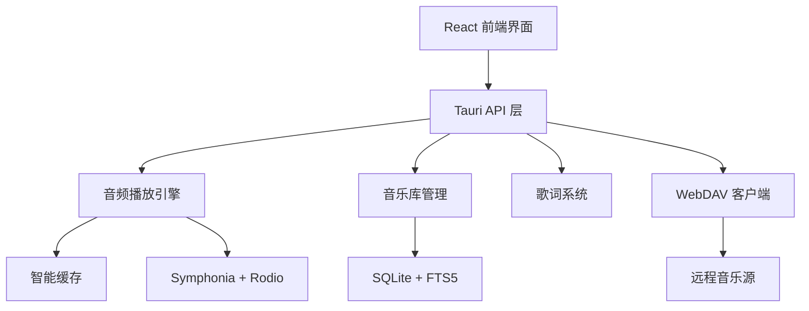

# WindChime Player

[](https://opensource.org/licenses/MIT)
[](https://github.com/ggbond/windchime)
[](https://tauri.app/)
[](https://reactjs.org/)

> 🎵 现代化跨平台音乐播放器，支持本地+WebDAV混合音乐源，提供沉浸式歌词体验

## 截图预览

### 主界面


### 沉浸式歌词


## ✨ 核心特性

### 🎵 音频播放
- **多格式支持** - MP3, FLAC, WAV, AAC, OGG 等主流格式
- **智能缓存** - 基于LRU的预加载算法，支持即时seek
- **音频增强** - 均衡器、空间音频效果（开发中）
- **歌单管理** - 创建、管理、播放自定义歌单（计划中）

### 🌐 远程音乐源
- **WebDAV集成** - 后端核心功能完成，前端正在开发
- **流式播放** - 直接从远程源流式播放，无需完整下载
- **混合模式** - 本地和远程音乐统一管理

### 🎤 沉浸式体验
- **全屏歌词** - 支持多种格式和8种智能滚动动画
- **动画系统** - 可自定义的动画配置（专家模式计划中）
- **简约设计** - 温柔米白主题，护眼舒适的现代化界面

### 🔧 开发者功能
- **性能监控** - 实时监控缓存、音频、系统性能（UI完成）
- **FTS5搜索** - 全文搜索，快速定位音乐
- **跨平台** - Windows, macOS, Linux 一键运行

## 🚀 快速开始

### 安装依赖
   ```bash
# 安装前端依赖
   pnpm install
   
# Rust 依赖会自动安装
   ```

### 开发运行
   ```bash
   pnpm tauri dev
   ```

### 构建应用
   ```bash
   pnpm tauri build
   ```

## 📁 项目结构

```
wind-chime-player/
├── src/                          # 🖥️ 前端 React 源码
│   ├── components/               # React 组件
│   │   ├── LibraryPage.tsx      # 音乐库页面
│   │   ├── PlaylistPlayer.tsx   # 播放器控制组件
│   │   ├── ImmersiveLyricsView.tsx # 沉浸式歌词视图
│   │   ├── LyricsDisplay.tsx    # 歌词显示组件
│   │   ├── LyricsManager.tsx    # 歌词管理器
│   │   ├── Sidebar.tsx          # 导航侧边栏
│   │   ├── TracksView.tsx       # 曲目列表视图
│   │   ├── AlbumsView.tsx       # 专辑视图
│   │   ├── ArtistsView.tsx      # 艺术家视图
│   │   ├── FavoritesView.tsx    # 收藏视图
│   │   ├── MusicFolderManager.tsx # 音乐文件夹管理
│   │   ├── PlaylistManager.tsx  # 播放列表管理
│   │   └── ExplorePage.tsx      # 发现页面
│   ├── assets/                  # 静态资源
│   ├── App.tsx                  # 主应用组件
│   ├── main.tsx                 # 前端入口
│   └── styles.css               # 全局样式
├── src-tauri/                   # 🦀 后端 Rust 源码
│   ├── src/
│   │   ├── lib.rs              # 主库文件 (Tauri 命令定义)
│   │   ├── main.rs             # 程序入口
│   │   ├── player.rs           # 🎵 音频播放引擎
│   │   ├── library.rs          # 📚 音乐库管理
│   │   ├── lyrics.rs           # 🎤 歌词解析系统
│   │   ├── db.rs               # 💾 数据库操作层
│   │   ├── music_source/       # 🌐 音乐源抽象层
│   │   │   ├── mod.rs          # 模块定义
│   │   │   ├── manager.rs      # 音乐源管理器
│   │   │   ├── provider.rs     # 音乐源提供器
│   │   │   └── types.rs        # 相关类型定义
│   │   └── webdav/             # 🌐 WebDAV 集成
│   │       ├── mod.rs          # 模块定义
│   │       ├── client.rs       # WebDAV 客户端
│   │       ├── auth.rs         # 认证管理
│   │       └── types.rs        # WebDAV 类型
│   ├── capabilities/           # Tauri 权限配置
│   ├── icons/                  # 应用图标
│   ├── Cargo.toml             # Rust 依赖配置
│   └── tauri.conf.json        # Tauri 应用配置
├── docs/                       # 📖 项目文档
│   ├── 集成webdav_docs/        # WebDAV 集成文档
│   └── repo-manual-snapshot.md # 项目手册快照
├── dist/                       # 构建输出目录
├── node_modules/               # Node.js 依赖
├── package.json               # 前端依赖配置
├── pnpm-lock.yaml            # PNPM 锁定文件
├── vite.config.ts            # Vite 构建配置
├── tailwind.config.js        # Tailwind CSS 配置
├── tsconfig.json             # TypeScript 配置
├── postcss.config.js         # PostCSS 配置
├── 设定.md                    # AI 开发助手设定
└── README.md                 # 项目说明文档
```

## 🏗️ 核心架构



### 🎯 核心模块

| 模块 | 功能 | 技术栈 | 状态 |
|------|------|--------|------|
| **音频引擎** | 播放、缓存、设备管理 | Rust + Symphonia + Rodio | ✅ 已完成 |
| **WebDAV客户端** | 远程音乐源支持 | Rust + reqwest | 🚧 后开发中 |
| **歌词系统** | 多格式解析、动画滚动 | Rust + React | ✅ 已完成 |
| **歌单系统** | 创建、管理播放列表 | SQLite + React | 📋 计划中 |
| **动画配置** | 可自定义动画系统 | React + TypeScript | 📋 计划中 |
| **性能监控** | 实时性能数据展示 | Rust + React | 🚧 UI完成，后端开发中 |
| **搜索引擎** | FTS5全文检索 | SQLite + Rust | ✅ 已完成 |

## 🛠️ 技术栈

**前端**: React 19 + TypeScript + Tailwind CSS + Vite  
**后端**: Rust + Tauri 2.0 + SQLite + Symphonia + Rodio  
**音频**: 硬件加速解码 + 智能缓存 + 设备诊断  
**数据**: SQLite FTS5 全文搜索 + 查询缓存优化  
**网络**: WebDAV + FTP + 流式传输 + Range请求

## ⭐ 技术亮点

### 🧠 创新特性
- **智能音频缓存**：基于LRU的预加载算法，支持即时seek
- **单引擎歌词滚动**：事件驱动的状态机，避免React竞态条件
- **自适应动画**：根据歌词时间间隔动态调整滚动参数
- **混合音乐源架构**：支持本地+WebDAV的可扩展音乐源系统
- **Stream转AsyncRead**：WebDAV字节流到Rust AsyncRead的完整转换

### 🎨 设计创新
- **简约现代美学**：温柔米白主题，护眼舒适的纯色实体设计
- **沉浸式体验**：全屏歌词+专辑封面的电影级音乐体验
- **响应式动画**：8种歌词滚动动画，支持实时切换和预览
- **性能可视化**：实时性能监控面板，提供详细的系统数据

### 🔧 架构优势
- **Actor模型**：基于Actor的播放引擎，清晰的职责分离
- **高内聚低耦合**：音乐源抽象层，支持插件化扩展
- **事件驱动架构**：前后端异步通信，保证界面响应性
- **性能优化**：查询缓存+并发扫描+硬件加速，多层性能保障

## 🎯 使用指南

### 基础使用
1. **添加音乐** - 在设置中添加音乐文件夹，点击扫描建立索引
2. **播放音乐** - 在音乐库中选择歌曲，支持多种播放模式
3. **查看歌词** - 点击歌词按钮进入沉浸式歌词模式

## 📦 构建与打包

### 开发环境运行
```bash
# 安装依赖
pnpm install

# 启动开发服务器
pnpm tauri:dev
```

### 打包 Windows 安装程序
```bash
# 构建生产版本（带中文安装界面）
pnpm tauri:build
```

打包完成后，安装程序位于：
```
src-tauri/target/release/bundle/nsis/WindChime Player_0.3.1_x64-setup.exe
```

#### 安装程序特性
- ✅ **支持中文**：安装时可选择简体中文或英文
- ✅ **用户级安装**：无需管理员权限
- ✅ **自动快捷方式**：桌面和开始菜单
- ✅ **WebView2 自动下载**：首次运行自动配置

详细打包说明请参考 [BUILD.md](BUILD.md)

## 📝 更新日志

### v0.3.1 (Current)
- ✅ **WebDAV后端完成** - Stream到AsyncRead转换，支持远程音频流式播放
- ✅ **性能监控UI** - 完整的性能监控面板界面
- ✅ **Actor架构优化** - 基于Actor模型的播放引擎重构
- ✅ **智能缓存系统** - PreloadActor实现，LRU预加载算法
- ✅ **沉浸式歌词优化** - 修复闪动问题，优化滚动动画
- 🚧 **WebDAV前端** - 前端集成开发中
- 🚧 **性能监控后端** - 数据采集功能开发中

### v0.2.0
- ✅ 完整的歌词系统实现
- ✅ 简约现代化UI设计（移除玻璃效果）
- ✅ 音乐库管理优化
- ✅ 温柔米白护眼主题

### v0.1.0
- ✅ 基础音频播放功能
- ✅ SQLite数据库集成
- ✅ FTS5全文搜索

## 🚧 开发路线图

### v0.4.0 - 功能完善（计划中）
- [ ] 歌单系统完整实现
- [ ] 性能监控后端数据接入
- [ ] 音频增强功能实现

### v0.5.0 - 高级功能（规划中）
- [ ] 动画专家模式和配置系统
- [ ] 播放列表智能推荐
- [ ] 云同步和备份功能
- [ ] 多主题支持

### v1.0.0 - 正式版（未来）
- [ ] 完整的音频处理链
- [ ] WebDAV集成和UI优化

### v2.0.0 - 正式版（未来）
- [ ] 移动端适配
## 🤝 参与贡献

### 🔥 热门贡献方向

- **🎵 音频功能**：音效处理、播放算法优化
- **🌐 WebDAV完善**：前端集成、用户体验优化
- **🎤 歌词增强**：更多歌词格式支持、同步算法优化
- **🎨 界面优化**：主题系统、界面组件完善
- **📊 性能监控**：后端数据采集、可视化增强

### 🛠️ 开发指南

1. **Fork** 项目并创建功能分支
2. **安装依赖**：`pnpm install`
3. **开发调试**：`pnpm tauri dev`
4. **提交 PR**：详细描述改动和测试情况

### 📋 代码规范
- Rust：遵循 `cargo fmt` 和 `cargo clippy`
- TypeScript：使用 Prettier 格式化
- 提交信息：使用 [约定式提交](https://www.conventionalcommits.org/)

欢迎通过 Issue 讨论新功能和改进建议！

## 📄 开源协议

MIT License - 详见 [LICENSE](LICENSE) 文件

---

**WindChime Player** - 让音乐如风铃般轻盈悦耳 🎵
