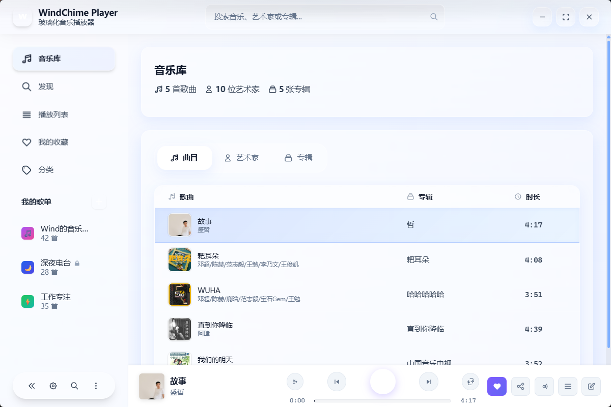
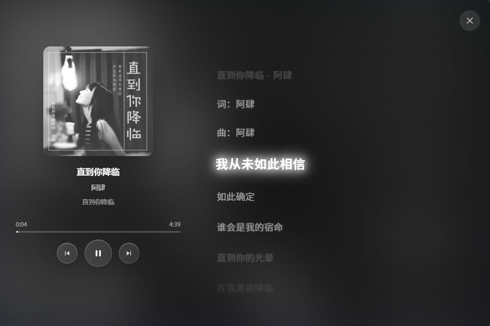

# WindChime Player

## 📄 开源协议

本项目采用 MIT 协议开源，详见 [LICENSE](LICENSE) 文件（Copyright © 2025 Wind）。

一款现代化的玻璃化音乐播放器，采用 Tauri + React 技术栈构建，注重用户体验和视觉美学。

## 🧾 关于软件

- **名称**: WindChime Player
- **当前版本**: v0.2.0
- **简介**: 一款现代化的玻璃化音乐播放器，采用 Tauri + React 技术栈构建，注重用户体验和视觉美学，提供流畅的音乐播放与管理功能。
- **亮点标签**: 音乐播放 · 智能搜索 · 玻璃化设计 · 高性能
- **作者**: Wind（独立开发者 · 音乐爱好者）
- **技术栈**: Rust · React · TypeScript · Tailwind CSS · Tauri
- **开源许可**: MIT License
- **最后更新**: 2025年9月14日

## 📱 界面预览

### 主界面 - 音乐库


- **玻璃化设计**: 采用现代毛玻璃效果，界面通透而不失层次感
- **智能音乐库**: 显示歌曲统计
- **多视图切换**: 支持曲目、艺术家、专辑三种浏览方式
- **详细信息**: 每首歌曲显示标题、艺术家、专辑、时长等完整信息
- **无边框窗口**: 自定义标题栏，提供沉浸式音乐体验

### 沉浸式歌词视图


- **全屏歌词体验**: 专注音乐内容，减少界面干扰
- **专辑封面展示**: 左侧显示精美的专辑封面艺术
- **实时歌词同步**: 当前播放的歌词行高亮显示
- **歌曲信息**: 显示完整的歌曲元数据（词曲作者等）
- **播放控制**: 底部提供播放/暂停、上下曲等基本控制

#### 歌词可视化设计要点
- **当前行聚焦**: 使用霓虹柔光与放大强调当前行，保证舞台式阅读焦点
- **层次衰减**: 非当前行按距离进行透明度与模糊衰减，营造景深
- **智能滚动动效**: 先进的歌词滚动动画系统
  - **单引擎架构**: `useLyricsScrollOrchestrator` Hook 管理所有滚动逻辑
  - **事件驱动**: 基于 `ScrollEvent` 的状态机，避免多个 `useEffect` 竞争
  - **自适应检测**: 根据歌曲特性动态调整 seek 检测阈值
  - **距离感知**: 滚动距离越远动画时长越长，提供自然的视觉感受
  - **多样化动画**: 支持 Q弹、平滑、特殊三大类共8种动画预设
  - **硬件加速**: 使用 `transform: translate3d` 和 `transition` 实现流畅动画
- **背景氛围**: 玻璃化背景与暗角过渡突出文本，同时不干扰封面展示
- **可读性优化**: 大字号、高对比度与行高优化，弱光环境下依然清晰
- **布局稳定**: 使用固定高度容器和 `transform: scale` 避免布局跳动
- **代码位置**: `src/components/ImmersiveLyricsView.tsx`、`src/components/LyricsDisplay.tsx`

## ✨ 特性

### 🎵 音频播放
- **多格式支持**: MP3, FLAC, WAV, AAC, OGG, M4A, WMA, APE 等主流音频格式
- **高质量播放**: 基于 Rodio + Symphonia 的音频引擎，支持无损音频
- **播放控制**: 播放/暂停、上一曲/下一曲、进度跳转、音量控制
- **播放模式**: 顺序播放、随机播放、单曲循环、列表循环

### 📚 音乐库管理
- **智能扫描**: 自动扫描指定文件夹，提取音乐元数据
- **元数据支持**: 标题、艺术家、专辑、时长、专辑封面
- **快速搜索**: 支持按歌曲名、艺术家、专辑进行模糊搜索
- **多视图展示**: 歌曲列表、艺术家视图、专辑视图

### 🎨 现代界面设计
- **玻璃化设计**: 如主界面截图所示的现代毛玻璃效果，界面通透而有层次
- **无边框窗口**: 自定义标题栏设计，提供沉浸式音乐体验
- **智能布局**: 左侧导航栏，右侧内容区，底部播放控制器的经典布局
- **响应式设计**: 自适应窗口大小变化，最小800x600分辨率
- **高对比度模式**: 支持无障碍访问，改善可读性
- **视觉层次**: 清晰的信息架构，重要信息突出显示

### 🎭 交互动画
- **软膜联动效果**: 鼠标悬停时产生弹性联动动画，营造软膜质感
- **歌词滚动动画**: 专业级歌词滚动动效系统
  - **多样化风格**: Q弹、平滑、特殊三大类共8种动画预设
  - **智能切换**: 水平滑动的动画类型切换界面，带有滑块指示器
  - **实时预览**: 设置界面中的动画效果实时展示
  - **单引擎架构**: 基于事件驱动的状态机，避免动画冲突
- **可调节参数**: 动画强度、影响范围等参数可自定义
- **流畅过渡**: 页面切换、状态变化均有流畅的过渡动画

### 🎤 歌词功能
- **沉浸式歌词体验**: 如截图所示的全屏歌词显示模式
- **专辑封面展示**: 歌词界面左侧展示高清专辑封面
- **实时同步显示**: 歌词随播放进度实时高亮，当前行突出显示
- **智能滚动动画**: 先进的歌词滚动动效系统，支持多种动画风格
  - **Q弹风格**: 轻柔、强烈、俏皮三种回弹效果，滚动结束时有轻微回弹
  - **平滑风格**: 优雅、敏捷、梦幻三种流畅效果，纯流畅滚动无回弹
  - **特殊效果**: 自然流动（仿生曲线）、精准快速（瞬间切换）
  - **自适应动画**: 根据歌词间隔自动调整动画时长和seek检测阈值
  - **距离感知**: 滚动距离越远动画时长越长，提供自然的视觉感受
- **完整元数据**: 显示词曲作者、专辑信息等详细信息
- **多格式支持**: 支持 LRC、SRT、ASS、VTT 等歌词格式
- **智能检索**: 自动从文件、元数据中提取歌词
- **歌词编辑**: 内置歌词编辑器，支持时间轴同步

### 📋 播放列表
- **播放列表管理**: 创建、编辑、删除自定义播放列表
- **智能生成**: 自动生成顺序/随机播放列表
- **拖拽排序**: 支持歌曲拖拽重新排序

### ⚙️ 个性化设置
- **音乐文件夹管理**: 添加/删除音乐库扫描路径
- **界面主题**: 高对比度模式切换
- **动画设置**: 
  - **软膜联动效果**: 开关和参数调节（强度、影响范围）
  - **歌词滚动动画**: 多种动画风格选择和实时预览
    - 三大动画类型：Q弹、平滑、特殊
    - 每类型包含多个子风格选项
    - 水平滑动的设置界面，支持动画类型快速切换
- **播放偏好**: 音量、播放模式等设置保存

## 🛠️ 技术栈

### 前端技术
- **React 19**: 现代化用户界面框架
- **TypeScript**: 类型安全的 JavaScript 超集
- **Tailwind CSS**: 实用优先的 CSS 框架
- **PostCSS**: CSS 后处理工具

### 后端技术
- **Rust**: 高性能系统编程语言
- **Tauri 2.0**: 跨平台桌面应用框架
- **Rodio**: 音频播放库
- **Symphonia**: 音频解码库
- **Lofty**: 音频元数据读取库
- **SQLite**: 轻量级数据库 (via rusqlite)

### 开发工具
- **Vite**: 快速构建工具
- **PNPM**: 高效的包管理器
- **Cargo**: Rust 包管理器和构建工具

## 📦 安装与使用

### 系统要求
- **操作系统**: Windows 10+, macOS 10.15+, Linux (Ubuntu 18.04+)
- **内存**: 最低 4GB RAM
- **存储**: 100MB 可用空间
- **音频**: 支持的音频输出设备

### 开发环境搭建

1. **安装依赖**
   ```bash
   # 安装 Node.js 依赖
   pnpm install
   
   # 安装 Rust 依赖 (自动执行)
   # Cargo 会自动下载和编译 Rust 依赖
   ```

2. **开发调试**
   ```bash
   # 启动开发服务器
   pnpm tauri dev
   ```

3. **构建应用**
   ```bash
   # 构建生产版本
   pnpm tauri build
   ```

### 使用说明

1. **首次使用**
   - 启动应用后，进入设置页面添加音乐文件夹
   - 点击"扫描"按钮建立音乐库索引
   - 音乐库会自动识别音频文件并提取元数据

2. **浏览音乐库**
   - 主界面显示音乐库统计信息（如截图中的"5首歌曲，5位艺术家，5张专辑"）
   - 支持三种视图：曲目列表、艺术家分组、专辑分组
   - 每首歌曲显示完整信息：标题、艺术家、专辑、时长

3. **播放音乐**
   - 点击歌曲列表中的播放按钮开始播放
   - 底部播放器显示当前播放状态和进度
   - 支持播放/暂停、上下曲、进度跳转等控制

4. **沉浸式歌词体验**
   - 点击歌词按钮进入全屏歌词模式
   - 左侧展示专辑封面，右侧显示同步歌词
   - 支持词曲作者信息显示
   - 歌词会随播放进度实时高亮

5. **个性化设置**
   - 在设置页面调整界面和播放偏好
   - 开启高对比度模式提升可访问性
   - 自定义软膜联动动画效果

## 📁 项目结构

```
wind-chime-player/
├── src/                    # 前端源码
│   ├── components/         # React 组件
│   │   ├── LibraryPage.tsx           # 音乐库页面
│   │   ├── PlaylistPlayer.tsx        # 播放器组件
│   │   ├── ImmersiveLyricsView.tsx   # 沉浸式歌词视图（含滚动动画）
│   │   ├── LyricsManager.tsx         # 歌词管理
│   │   ├── LyricsDisplay.tsx         # 歌词显示组件
│   │   ├── Sidebar.tsx               # 侧边导航
│   │   └── ...
│   ├── App.tsx            # 主应用组件（含动画设置界面）
│   ├── main.tsx           # 应用入口
│   └── styles.css         # 全局样式
├── src-tauri/             # Rust 后端源码
│   ├── src/
│   │   ├── lib.rs              # 主库文件
│   │   ├── player.rs           # 音频播放器
│   │   ├── library.rs          # 音乐库管理
│   │   ├── db.rs               # 数据库操作
│   │   └── lyrics.rs           # 歌词处理
│   ├── Cargo.toml         # Rust 依赖配置
│   └── tauri.conf.json    # Tauri 配置
├── docs/                  # 技术文档
│   └── 方案B-单引擎歌词滚动实现手册.md  # 歌词动画技术文档
├── 歌词滚动实现手册@设定.md .md        # 歌词滚动功能规范
├── 设定.md                # AI开发助手规范
├── LICENSE                # 开源许可文本（MIT）
├── package.json           # Node.js 依赖配置
└── README.md             # 项目说明文档
```

## 🎯 核心功能模块

### 音频播放引擎
- 基于 Rodio 音频库，支持跨平台音频输出
- Symphonia 提供全格式音频解码支持
- 实时进度跟踪和位置跳转
- 音量控制和播放状态管理

### 音乐库索引
- 递归扫描指定目录，识别音频文件
- Lofty 库提取音频元数据和专辑封面
- SQLite 数据库存储音乐信息
- 全文搜索和分类浏览

### 用户界面
- React 函数式组件和 Hooks
- Tailwind CSS 实现玻璃化设计
- 响应式布局适配不同屏幕尺寸
- 自定义动画和交互效果
- 先进的歌词滚动动画引擎（单引擎状态机架构）

## 🔧 配置说明

### 数据库结构
应用使用 SQLite 数据库存储音乐元数据，主要表结构：
- `tracks`: 音乐文件信息
- `playlists`: 播放列表
- `playlist_tracks`: 播放列表关联
- `lyrics`: 歌词数据

### 配置文件
- `tauri.conf.json`: 窗口设置、权限配置
- `tailwind.config.js`: 样式主题配置
- `package.json`: 前端依赖和脚本
- `Cargo.toml`: Rust 依赖和功能特性

## 🚀 性能优化

- **音频流处理**: 使用 Rust 异步处理，避免阻塞 UI
- **数据缓存**: 音乐库数据智能缓存，减少重复加载
- **延迟加载**: 专辑封面按需加载，节省内存
- **事件驱动**: 前后端通过事件通信，响应及时

## 🔒 安全特性

- **沙盒环境**: Tauri 提供安全的运行环境
- **权限控制**: 最小化系统权限请求
- **数据隔离**: 用户数据存储在应用专有目录
- **输入验证**: 严格验证用户输入和文件路径

## 🌟 开发亮点

### 界面设计创新
- **玻璃化美学**: 如截图展示的现代毛玻璃设计，营造通透而有层次的视觉体验
- **沉浸式歌词**: 全屏歌词模式结合专辑封面，提供电影级的音乐体验
- **信息层次**: 清晰的视觉层次，重要信息一目了然（如音乐库统计、歌曲详情）
- **无边框设计**: 自定义窗口控件，最大化内容展示空间

### 用户体验优化
- **零配置启动**: 开箱即用，无需复杂设置
- **智能音乐库**: 自动统计和分类，如截图中的"5首歌曲，5位艺术家，5张专辑"
- **多维度浏览**: 支持按曲目、艺术家、专辑三种方式浏览音乐
- **实时歌词同步**: 歌词随播放进度精准同步，当前行高亮显示

### 技术架构优势
- **前后端分离**: React 负责 UI，Rust 处理音频和数据
- **事件驱动**: 异步事件通信，保证界面响应性
- **模块化设计**: 功能模块解耦，便于维护扩展
- **跨平台**: 基于 Tauri 的一套代码支持多个操作系统

### 功能完整性
- **专业音频引擎**: 基于 Rodio + Symphonia，支持多种音频格式
- **完整元数据**: 从截图可见的详细歌曲信息（标题、艺术家、专辑、时长）
- **智能歌词系统**: 支持多格式歌词，自动同步显示，配备先进的滚动动画引擎
- **个性化设置**: 软膜联动动画、歌词滚动效果等独特交互效果可自定义

### 技术创新亮点
- **歌词滚动动画引擎**: 首创单引擎状态机架构
  - **事件驱动设计**: 基于 `ScrollEvent` 的状态机避免 React `useEffect` 竞争
  - **自适应算法**: 根据歌曲特性动态调整动画参数和seek检测阈值  
  - **多层次动画**: 8种预设动画风格，支持 cubic-bezier 自定义缓动曲线
  - **硬件加速优化**: 使用 GPU 加速的 `transform3d` 实现60fps流畅动画
  - **布局稳定性**: 固定容器高度 + `transform: scale` 避免重排重绘

## 📈 未来规划

- **均衡器**: 音频均衡器和音效处理
- **在线歌词**: 自动下载在线歌词服务
- **主题系统**: 更多界面主题和自定义选项
- **插件系统**: 支持第三方功能扩展
- **云同步**: 播放列表和设置云端同步

## 🤝 贡献指南

欢迎提交 Issue 和 Pull Request 来改进项目！

### 开发规范
- 遵循 Rust 和 TypeScript 最佳实践
- 使用有意义的提交信息
- 添加适当的注释和文档
- 确保代码通过测试和格式检查

### 问题报告
- 提供详细的问题描述和重现步骤
- 包含系统信息和错误日志
- 如可能，提供最小化的测试用例


## 🧯 法律合规与隐私

- **数据采集**: 应用不收集、上传或分析任何个人数据；不包含遥测。开发模式的 `devUrl` 仅指向本地 `http://localhost:1420`。
- **网络访问**: 代码库未实现对外网的 `fetch`/HTTP 请求；当前版本不依赖任何在线服务。
- **数据存储**: 本地 `SQLite` 数据库存储音乐元数据与用户自行导入/解析的歌词；数据仅存于本机。
- **权限最小化**: `src-tauri/capabilities/default.json` 仅声明窗口与文件对话框最小权限，无通配文件系统、网络或剪贴板等高风险权限。

## 📜 第三方许可与义务（摘要）

> 下列为主要依赖的许可类型与合规提示，二次分发请保留本项目 `LICENSE`，并按需附带第三方许可与 NOTICE 链接。

- **Symphonia（音频解码）**: 可能采用 MPL-2.0（文件级弱版权）。义务：若修改其受保护源文件并分发，需要开放这些修改的源文件；未修改时可通过提供上游源码链接与相应 NOTICE 满足义务。项目主页与源码见 `https://github.com/pdeljanov/symphonia`。
- **Rodio / CPAL / Tokio / encoding_rs / rusqlite / Lofty / Tauri / React / Tailwind / Vite**: 多数为 **MIT** 或 **Apache-2.0** 或二者可选。义务：保留版权与许可声明。

兼容性提示：MIT 与 Apache-2.0 与 MPL-2.0 可共存；若进行二次打包分发，建议在发行物中附上本项目 LICENSE，并在 README 的本节保留第三方许可说明与上游链接。

## 🧩 编解码器与专利声明

- 某些音频编解码器（如 AAC 等）在部分司法辖区可能受专利保护。项目使用开源库进行解析/播放，但发行成品前请根据目标市场自行评估是否涉及专利许可。
- 不内置专有或付费编解码器实现；通过 Symphonia 使用开源解码器。部分格式（如 AAC）在个别司法辖区可能涉及历史专利/许可，请在发行前按目标市场评估。

## 📑 商标与素材版权

- 应用展示的专辑封面、歌词文本、多媒体文件均来源于用户本地文件，其版权归原权利人所有。
- 未经授权请勿分发受版权保护的歌词与封面素材；截图、演示中如包含第三方作品，仅作功能演示，不代表许可授权。

## 🌐 在线歌词与内容来源（规划项）

- 若未来集成在线歌词/封面服务：
  - 必须遵守服务的使用条款（ToS）与许可限制；
  - 在 UI 中标注内容来源与版权信息；
  - 遵循缓存、离线存储与再分发限制；
  - 提供用户可控的开关与数据清理能力。

## ✅ 合规自查清单（当前版本）

- 已添加 `LICENSE`（MIT）。
- `package.json` 已声明 `license: MIT`。
- 未发现对外部网络接口的调用。
- 权限配置采用最小化原则，无高风险权限。
- 建议在发行包随附本 README 的“第三方许可与义务”章节与上游链接。

## 🙏 致谢

感谢以下开源项目和社区的支持：
- [Tauri](https://tauri.app/) - 跨平台应用框架
- [Rodio](https://github.com/RustAudio/rodio) - Rust 音频播放库
- [React](https://reactjs.org/) - 用户界面库
- [Tailwind CSS](https://tailwindcss.com/) - CSS 框架

---

## 🎯 实际应用展示

从上面的界面截图可以看到，WindChime Player 不仅在技术上优秀，在实际使用中也提供了出色的用户体验：

### 主界面特点
- 简洁而功能完整的音乐库界面
- 准确的统计信息显示（5首歌曲，5位艺术家，5张专辑）
- 清晰的歌曲列表展示（如"故事"、"起耳朵"、"WUHA"、"直到你降临"、"我们的明天"等歌曲）
- 完整的元数据显示（艺术家、专辑、时长信息）
- 底部播放控制器实时显示播放状态

### 歌词体验
- 沉浸式全屏歌词模式，专注音乐内容
- 左侧专辑封面艺术展示，右侧歌词同步显示
- 当前播放行高亮，提供良好的阅读体验
- 完整的歌曲信息展示（词曲作者等）

这些实际运行的界面展示了 WindChime Player 在设计理念和技术实现上的成功结合，为用户提供了既美观又实用的音乐播放体验。

---

**WindChime Player** - 让音乐如风铃般轻盈悦耳 🎵
