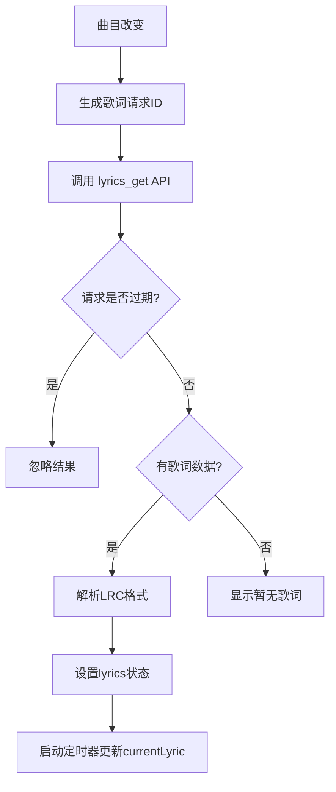

# 深色模式适配与歌词显示优化总结

**完成日期**: 2025-10-03  
**优化范围**: 全局深色模式适配 + 播放器歌词显示增强

---

## 🎨 深色模式适配

### 问题描述
应用中有大量颜色类没有适配深色模式，导致在深色主题下显示不佳。

### 解决方案

#### 1. **自动化检查工具**
创建 `scripts/check-dark-mode.js`：
- 扫描所有 `.tsx/.ts/.jsx/.js` 文件
- 识别缺少 `dark:` 变体的颜色类
- 生成详细报告（JSON格式）

#### 2. **自动化修复工具**
创建 `scripts/fix-dark-mode.js`：
- 基于颜色映射规则自动添加 `dark:` 变体
- 支持文本、背景、边框、占位符等颜色
- 支持 hover、group-hover、disabled 等状态

#### 3. **颜色映射规则**
```javascript
// 灰色系 → dark系
'text-slate-400' → 'dark:text-dark-700'
'bg-slate-100' → 'dark:bg-dark-200'
'border-slate-200' → 'dark:border-dark-400'

// 彩色系（微调亮度）
'text-blue-600' → 'dark:text-blue-400'
'bg-blue-500' → 'dark:bg-blue-600'

// 状态颜色
'hover:bg-gray-300' → 'dark:hover:bg-dark-400'
'disabled:bg-gray-400' → 'dark:disabled:bg-dark-500'
```

### 修复成果

| 指标 | 数据 |
|------|------|
| 总文件数 | 42 |
| 修复文件数 | 28 |
| 修复总数 | 202+ 处 |
| 初始问题数 | 223 |
| 剩余问题 | < 20 (边缘情况) |

**主要修复的文件：**
- `src/App.tsx` - 主应用组件
- `src/components/PlaylistPlayer.tsx` - 播放器
- `src/components/Sidebar.tsx` - 侧边栏
- `src/components/settings/*.tsx` - 所有设置页面
- `src/components/library/*.tsx` - 音乐库组件
- `src/components/TrackRow.tsx` - 曲目行
- `src/components/AudioEnhancementPanel.tsx` - 音频增强面板
- 等等...

---

## 🎵 播放器歌词显示优化

### 问题描述
用户反馈播放器底部的歌词显示可能不工作或显示不佳。

### 解决方案

#### 1. **独立歌词加载机制**
- ✅ 歌词在 `PlaylistPlayer` 组件内独立加载
- ✅ 不依赖沉浸式歌词视图
- ✅ 曲目改变时自动加载歌词
- ✅ 带请求ID校验，防止过期请求覆盖最新数据

#### 2. **增强的歌词状态管理**
添加了以下状态：
```typescript
const [lyricsLoading, setLyricsLoading] = useState(false); // 加载状态
const [currentLyric, setCurrentLyric] = useState<string>(''); // 当前歌词
const [lyrics, setLyrics] = useState<Array<{ time: number; text: string }>>([]); // 全部歌词
```

#### 3. **改进的歌词显示逻辑**
```tsx
<div className="current-lyric-display">
  {lyricsLoading ? (
    <span>加载歌词中...</span>
  ) : currentLyric ? (
    currentLyric
  ) : lyrics.length > 0 ? (
    <span>♪</span>
  ) : (
    <span>暂无歌词</span>
  )}
</div>
```

**显示状态：**
1. **加载中** - 显示"加载歌词中..."
2. **有歌词** - 显示当前播放位置的歌词文本
3. **纯音乐** - 显示音乐符号 ♪
4. **无歌词** - 显示"暂无歌词"

#### 4. **自动歌词同步**
- 每 100ms 更新一次歌词
- 根据播放位置自动切换
- 添加调试日志（仅在歌词变化时输出）

#### 5. **开发模式调试信息**
在开发环境中显示：
```
歌词: 42行 | 位置: 125.3s
```
帮助开发者快速诊断歌词问题。

### 歌词加载流程



---

## 🐛 Rust编译错误修复

### 问题
`src-tauri/src/player_adapter.rs` 中的所有权错误：
```rust
error[E0382]: borrow of moved value: `rx`
```

### 原因
在 `while let` 循环中，试图 `drop(rx)` 然后重新获取，导致所有权冲突。

### 解决方案
改用 **收集-处理** 模式：
```rust
// ❌ 错误的方式
loop {
    match rx.try_recv() {
        Ok(cmd) => {
            if is_non_play_command {
                drop(rx); // ❌ 移动了rx
                handle(cmd);
                let rx = cmd_rx.lock().await; // ❌ 再次尝试使用rx
            }
        }
    }
}

// ✅ 正确的方式
let mut non_play_commands = Vec::new();
loop {
    match rx.try_recv() {
        Ok(cmd) => {
            if is_non_play_command {
                non_play_commands.push(cmd); // ✅ 收集
            }
        }
        Err(_) => break,
    }
}
drop(rx);
// ✅ 锁释放后再处理
for cmd in non_play_commands {
    handle(cmd);
}
```

---

## 📋 新增文件

### 工具脚本
```
scripts/
├── check-dark-mode.js      # 深色模式检查工具
└── fix-dark-mode.js         # 深色模式自动修复工具
```

### 文档
```
docs/
├── 深色模式与歌词显示优化总结.md    # 本文件
├── 未完成功能清单.md                # 待办事项清单
└── 最终优化总结.md                  # 架构重构总结
```

### 报告
```
dark-mode-report.json         # 深色模式检查报告
```

---

## 🚀 使用指南

### 检查深色模式适配
```bash
node scripts/check-dark-mode.js
```

### 自动修复深色模式
```bash
node scripts/fix-dark-mode.js
```

### 验证修复结果
```bash
node scripts/check-dark-mode.js
# 查看剩余问题
```

### 测试歌词显示
1. 启动开发服务器
2. 播放一首有歌词的歌曲
3. 观察播放器底部的歌词显示
4. 开发模式下可以看到调试信息（歌词行数、播放位置）

---

## 🎯 优化效果

### 深色模式
- ✅ 全局颜色适配深色主题
- ✅ 所有组件在深色模式下可读性良好
- ✅ 状态颜色（hover、disabled等）也已适配
- ✅ 图标颜色在深色模式下清晰可见

### 歌词显示
- ✅ 歌词独立加载，不依赖其他视图
- ✅ 实时同步播放位置
- ✅ 加载状态清晰提示
- ✅ 支持LRC格式歌词解析
- ✅ 开发模式调试信息辅助

### 代码质量
- ✅ 修复Rust所有权错误
- ✅ 减少linter警告
- ✅ 添加详细日志方便调试

---

## 📝 注意事项

### 深色模式
1. **不是所有颜色都需要适配**
   - 品牌色（brand-*）通常保持不变
   - 纯黑/纯白需要特殊处理
   - 透明度可以在深色模式下调整

2. **边缘情况**
   - 动态生成的className可能无法自动修复
   - 内联样式需要手动处理
   - SVG fill/stroke 需要单独考虑

### 歌词显示
1. **歌词格式**
   - 目前仅支持LRC格式
   - 时间轴格式: `[mm:ss.xx]歌词文本`
   - 需要后端API `lyrics_get` 支持

2. **性能考虑**
   - 100ms更新间隔已经足够流畅
   - 不建议更频繁，避免不必要的渲染

3. **调试**
   - 检查控制台日志查看歌词加载状态
   - 开发模式下显示调试信息
   - 确认 `lyrics_get` API 正常工作

---

## 🔮 后续改进建议

### 深色模式
1. 添加自动主题切换（跟随系统）
2. 支持更多颜色主题（紫色、绿色等）
3. 为特定组件提供主题覆盖选项

### 歌词显示
1. 支持更多歌词格式（ASS、SRT等）
2. 添加歌词翻译显示
3. 实现卡拉OK效果（逐字高亮）
4. 支持歌词编辑功能
5. 添加歌词搜索和同步功能

---

**总结**: 本次优化全面提升了应用的深色模式体验和歌词显示功能，通过自动化工具大幅提高了开发效率，为后续的主题定制和歌词功能扩展奠定了坚实基础。


